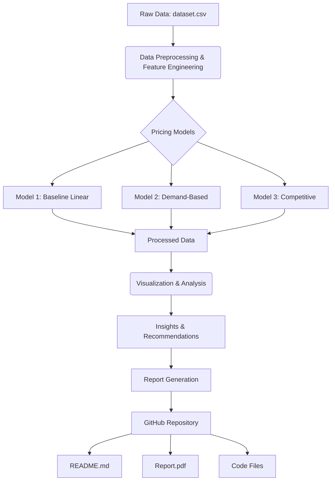

# Dynamic Parking Pricing Model

## Project Overview

This project focuses on developing and analyzing dynamic pricing models for parking lots. The primary goal is to optimize parking prices in real-time based on various factors such as occupancy, traffic conditions, and competitive pricing, ultimately aiming to maximize revenue and efficiently manage parking demand. The solution involves data analysis, feature engineering, and the implementation of three distinct pricing models: a Baseline Linear Model, a Demand-Based Price Function, and a Competitive Pricing Model.

## Tech Stack Used

- **Python**: The core programming language used for data processing, model development, and visualization.
- **Pandas**: A powerful data manipulation and analysis library for Python.
- **NumPy**: A fundamental package for numerical computing in Python, used for array operations.
- **Matplotlib**: A comprehensive library for creating static, animated, and interactive visualizations in Python.
- **Seaborn**: A data visualization library based on matplotlib, providing a high-level interface for drawing attractive and informative statistical graphics.

## Architecture Diagram

## Detailed Explanation of Project Architecture and Workflow

### 1. Data Ingestion and Preprocessing

The project begins by ingesting raw parking data from a CSV file (`dataset.csv`). This data includes various attributes such as `ID`, `SystemCodeNumber`, `Capacity`, `Latitude`, `Longitude`, `Occupancy`, `VehicleType`, `TrafficConditionNearby`, `QueueLength`, `IsSpecialDay`, `LastUpdatedDate`, and `LastUpdatedTime`. 

During the preprocessing phase, the `LastUpdatedDate` and `LastUpdatedTime` columns are combined and converted into a single `LastUpdatedDateTime` datetime object. The dataset is then sorted by `SystemCodeNumber` and `LastUpdatedDateTime` to ensure chronological order for each parking lot, which is crucial for time-series analysis and model application.

### 2. Feature Engineering

Several new features are engineered from the raw data to enhance the models' predictive capabilities:
- **Occupancy Rate**: Calculated as the ratio of `Occupancy` to `Capacity`. This provides a normalized measure of how full a parking lot is.
- **VehicleTypeWeight**: Categorical `VehicleType` data (e.g., 'car', 'bike', 'truck', 'cycle') is mapped to numerical weights. This allows the models to incorporate the influence of different vehicle types on demand and pricing.
- **TrafficConditionWeight**: Similar to `VehicleType`, `TrafficConditionNearby` (e.g., 'low', 'average', 'high') is converted into numerical weights to reflect its impact on parking demand.

### 3. Pricing Model Development

Three distinct dynamic pricing models are implemented:

#### Model 1: Baseline Linear Model
This is the simplest model, serving as a baseline. It adjusts the price linearly based on the current occupancy rate. The price for the next time step is determined by adding a factor proportional to the occupancy rate to the current price. This model is applied iteratively for each parking lot, demonstrating a basic dynamic adjustment.

#### Model 2: Demand-Based Price Function
This model takes a more comprehensive approach by calculating a 'Demand' score based on multiple factors: `OccupancyRate`, `QueueLength`, `TrafficConditionWeight`, `IsSpecialDay`, and `VehicleTypeWeight`. Each factor is assigned a coefficient to reflect its influence on demand. The calculated `Demand` is then normalized (min-max normalization) per parking lot to ensure comparability. Finally, the price is set as a base price multiplied by a factor that increases with the normalized demand, allowing for more nuanced price adjustments based on a holistic view of demand drivers.

#### Model 3: Competitive Pricing Model
Building upon Model 2, this model introduces a competitive element. It considers the prices of nearby parking lots to influence the current lot's pricing strategy. The Haversine formula is used to calculate the geographical distance between parking lots. A `distances_matrix` is pre-calculated to store these distances, optimizing performance. For each parking lot, the model identifies nearby competitors within a specified `influence_radius`. It then calculates the average Model 2 price of these competitors. The current lot's price is adjusted based on the difference between its Model 2 price and the average competitor price, incorporating a `price_sensitivity` factor. This ensures that the pricing remains competitive while still reflecting internal demand. The model also includes a logic to further reduce prices if a lot is nearly full and competitors are cheaper, encouraging efficient space utilization.

### 4. Visualization and Analysis

After applying the pricing models, the processed data, including the calculated prices from each model, is saved to `processed_parking_data.csv`. A separate Python script (`visualize_pricing_models.py`) is used to generate various plots and charts to visualize the model outputs and derive insights. These visualizations include:
- Price comparison of all three models over time for a sample parking lot.
- Scatter plots showing the impact of `OccupancyRate` and `QueueLength` on Model 2 prices.
- Histograms illustrating the distribution of prices for each model.
- Box plots demonstrating price variations by `VehicleType` and `TrafficConditionNearby` for Model 2.
- A correlation heatmap to show relationships between features and model prices.

These visualizations help in understanding the dynamics of each model, the influence of different features, and the overall pricing behavior.

### 5. Reporting and Submission

All findings, model details, and visualizations are compiled into a comprehensive report (`dynamic_pricing_report.md`), which is then converted into a PDF (`dynamic_pricing_report.pdf`). The final submission includes this report, all the Python code files, and the `README.md` file, organized within a GitHub repository. This ensures that the project is well-documented, reproducible, and easily accessible for review.

## Other Relevant Documentation

- `problemstatement.pdf`: Original problem statement document.
- `dataset.csv`: The raw dataset used for analysis.
- `dynamic_pricing_model.py`: Python script containing the data preprocessing, feature engineering, and pricing model implementations.
- `visualize_pricing_models.py`: Python script for generating visualizations from the processed data.
- `processed_parking_data.csv`: The output CSV file containing the processed data with added features and model-generated prices.